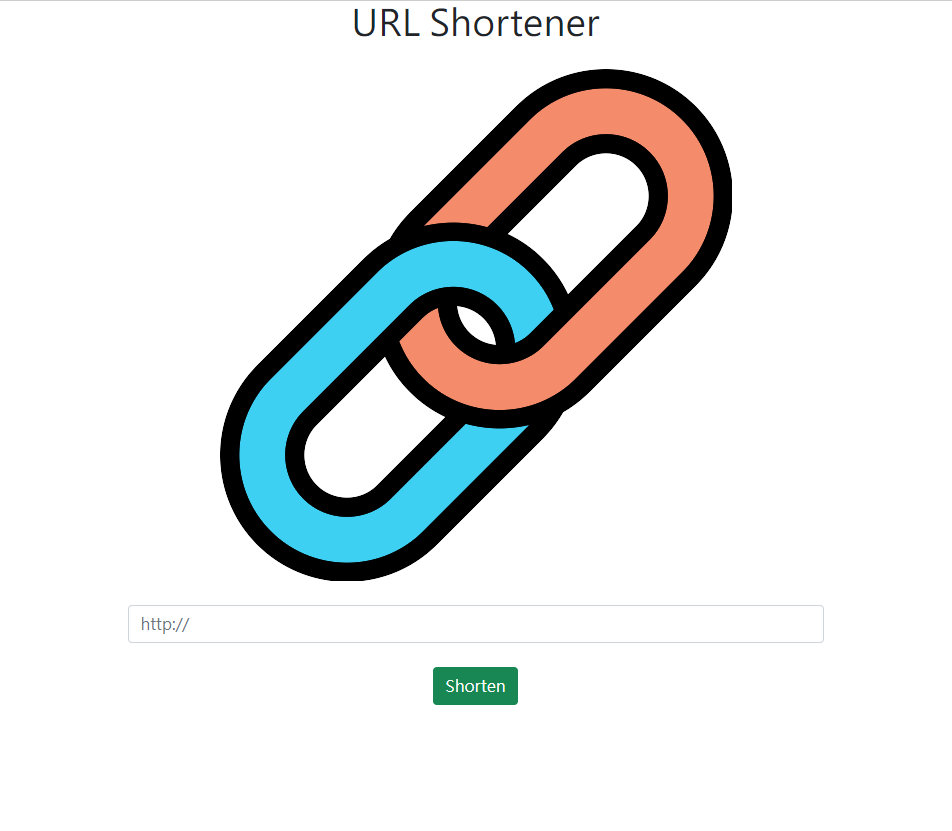
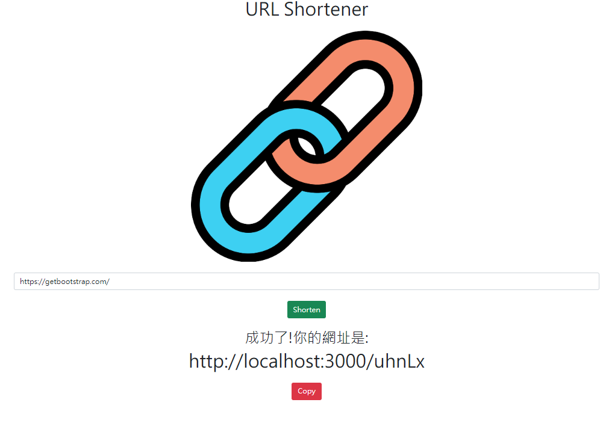
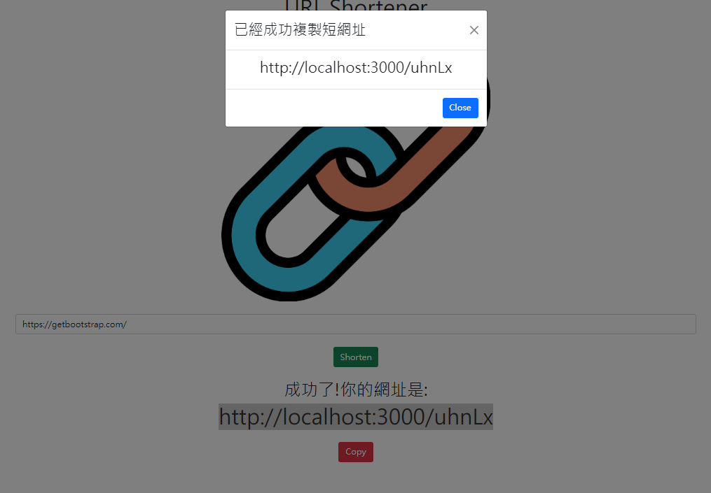

# URL Shortener 短網址產生器

## 使用方式

進入後的首頁畫面



輸入網址後，按下Shorten會獲得縮短網址，路由縮短成五個隨機亂數。



按下下方的copy按鈕，跳出訊息顯示成功複製縮短後的網址。



在APP啟動的狀況下輸入縮短後的網址，即可回到最初填入的網站畫面。


##  Getting Start
- Clone the project
```
$ git clone https://github.com/LAI-Recycle/URL-shortener.git
```
- Install the required dependencies
```
$ npm install
```
- 建立 .env 文件，連線至你的 MongoDB (注意<>的地方)
```
MONGODB_URI=mongodb+srv://<Your MongoDB Account>:<Your MongoDB Password>@cluster0.xxxx.xxxx.net/<Your MongoDB Table><?retryWrites=true&w=majority
```
- Install nodemon
```
$ npm i nodemon
```
- Start the server
```
$ npm run dev
```
- Execute successfully if seeing following message
```
App is running on http://localhost:3000
```

## 開發工具
- Node.js 18.14.1
- Express 4.17.1
- Express-Handlebars 4.0.2
- MongoDB
- mongoose 5.9.7
